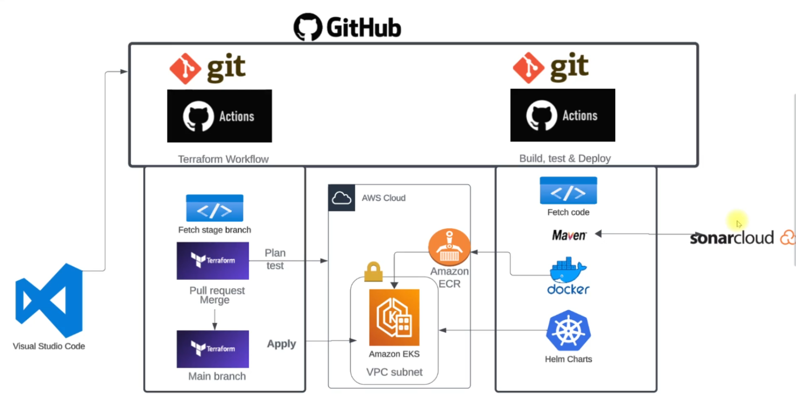
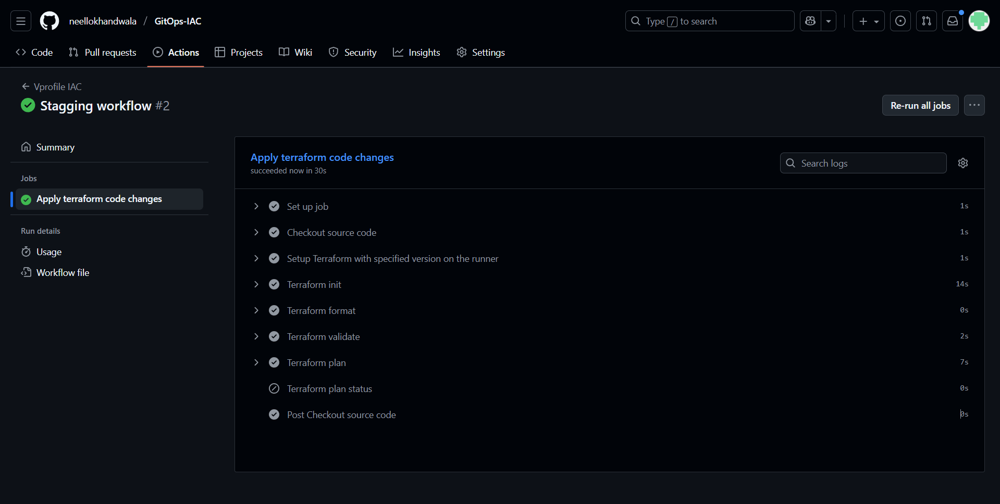
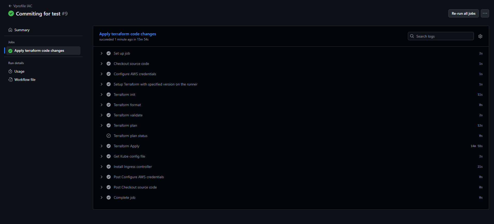
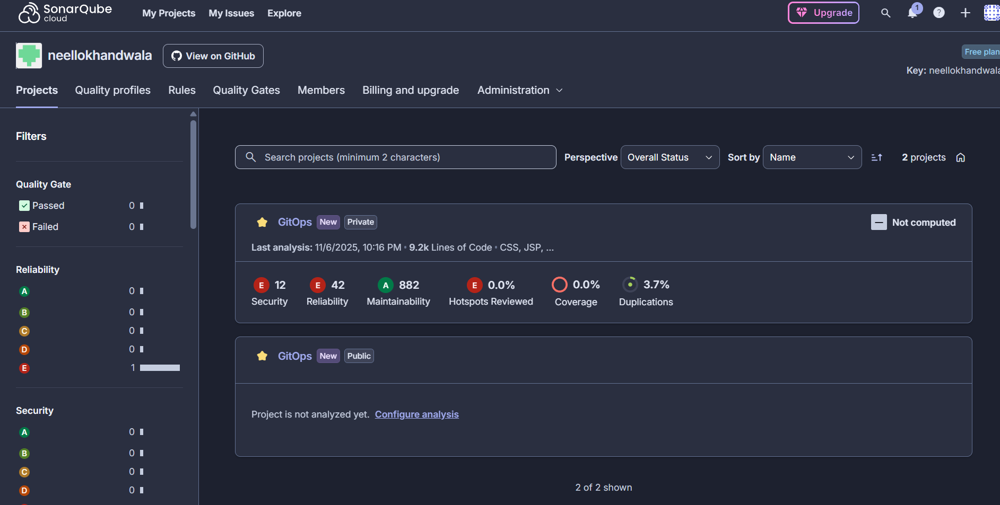
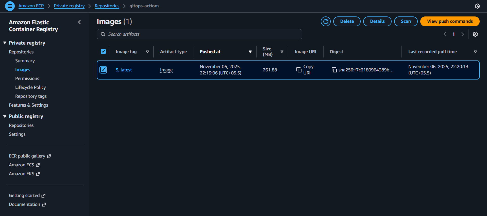
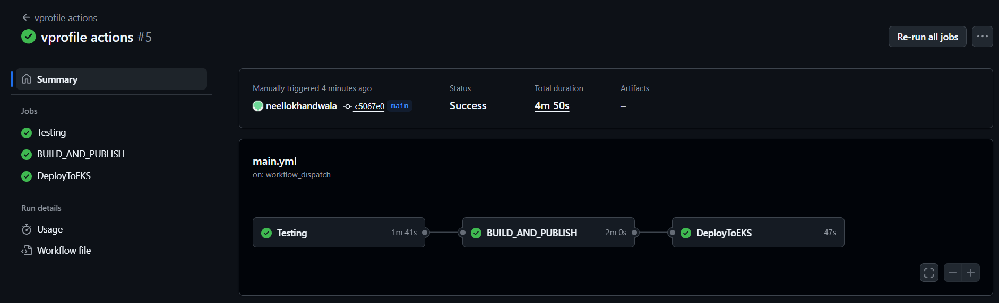
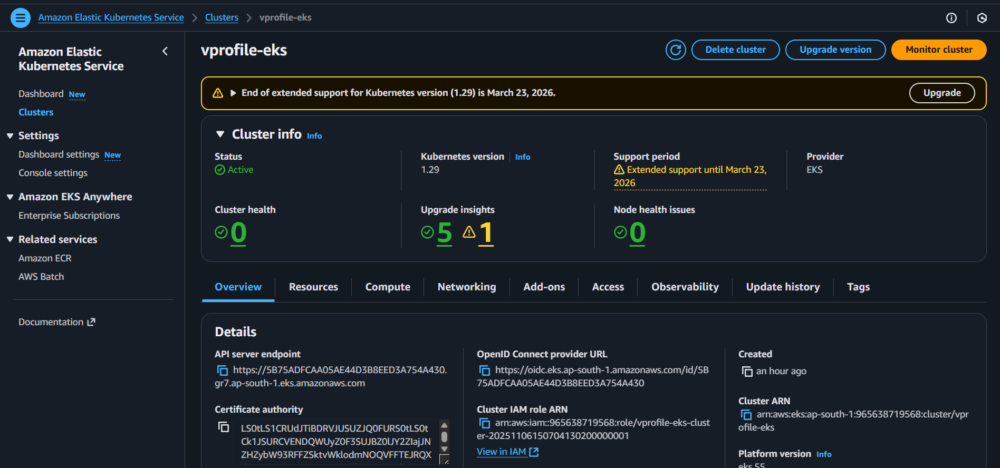
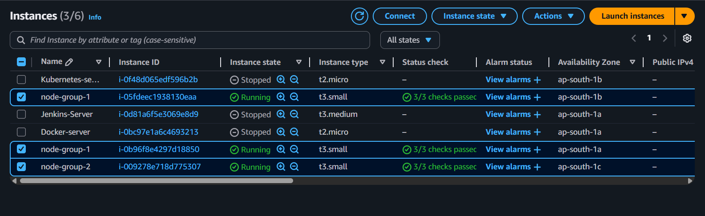
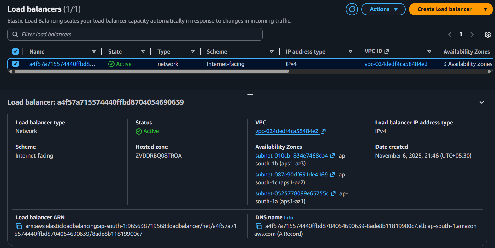
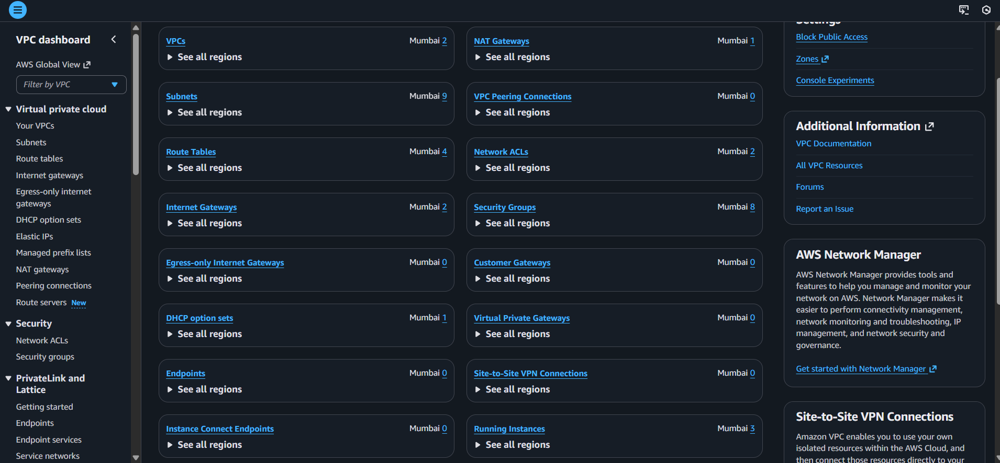

# GitOps Project: AWS EKS | Terraform | GitHub Actions | Maven | Docker | Helm | SonarCloud | VPC

This project demonstrates a **complete GitOps workflow** for deploying an application to a Kubernetes cluster running on **Amazon EKS**, where both the **Infrastructure** and **Application Deployment** are **fully automated** through **GitHub Actions**.

The implementation is divided into **two repositories**:

1. **Infrastructure Repository (IAC)**  
   Contains Terraform code which provisions AWS infrastructure such as VPC, Subnets, EKS Cluster, Node Groups, ECR, IAM roles, Load Balancer, and Networking Components.

2. **Application Repository**  
   Contains the source code of the application. It includes CI steps (build, test, code quality scan) and CD steps (containerization, push to ECR, Deployment to EKS using Helm).

This approach ensures **declarative infrastructure and automated continuous delivery**, following modern **GitOps principles**.

---

## **High Level Architecture**

**Key Services Involved:**
- **AWS VPC & Subnets** – Networking foundation  
- **Amazon EKS** – Kubernetes control plane workload hosting  
- **EC2 Node Groups** – Worker nodes to run pods  
- **Amazon ECR** – Container registry for storing Docker images  
- **ALB / Load Balancer** – Public entry to the application  
- **Terraform** – Infrastructure provisioning  
- **GitHub Actions** – CI/CD automation  
- **SonarCloud** – Code quality and static analysis  
- **Helm Charts** – Standardized Kubernetes deployment packaging  

---

## **Workflow Overview**

### **1. Infrastructure GitOps Workflow (Terraform)**

Whenever changes are pushed to the Terraform directory or pull requests are opened:
- A GitHub Actions pipeline is triggered
- The workflow performs:
  - Initialization of Terraform
  - Code formatting and validation
  - Infrastructure planning (**for review**)
  - On main branch → **Automatic Terraform Apply**
- After successful apply:
  - Kubeconfig is retrieved
  - **NGINX Ingress Controller is installed** on the EKS cluster

This means the **entire AWS environment is provisioned via commits** and not manually.

**Screenshots:**
| Purpose | Screenshot |
|--------|------------|
| Terraform Plan on Stage Branch |  |
| Terraform Apply Workflow on Main Branch |  |

---

### **2. Application CI/CD Workflow**

This workflow runs for application repository (right-side of architecture).

The pipeline has **three major phases**:

#### **a) Testing & Quality Scanning**
- The code is checked out and built using Maven
- Unit Tests are executed
- Code formatting rules enforced via Checkstyle
- Code quality and static analysis is pushed to **SonarCloud**

#### **b) Build & Publish**
- Docker image is built from the application code
- The image is tagged and pushed to **Amazon ECR**

#### **c) Helm Deployment to EKS**
- Kubernetes cluster credentials are fetched
- A Kubernetes pull secret is created to allow image fetching from ECR
- Helm chart is applied to deploy/update application on EKS

---

## **Amazon EKS and Deployment Verification**

Once the deployment completes, the application runs as Pods inside the EKS cluster.

| Component | Screenshot |
|---------|------------|
| Running EKS Cluster |  |
| Node Groups (Worker Nodes) |  |
| Load Balancer Created via Ingress |  |
| VPC Networking Dashboard |  |

The Load Balancer provides a public endpoint to access the deployed application.

---

## **Key Features & Advantages**

| Benefit | Explanation |
|--------|-------------|
| **100% Infrastructure as Code** | No manual AWS configuration; everything is declaratively managed. |
| **Fully Automated CI/CD Pipeline** | Code → Test → Scan → Build → Deploy triggers automatically. |
| **Security Built-In** | Uses GitHub secrets for access credentials and ECR private image repository. |
| **Scalable Kubernetes Deployment** | Application is deployed on EKS using Helm charts. |
| **Quality Confidence** | SonarCloud ensures coding standards, maintainability and test coverage. |
| **GitOps Driven Change Management** | Every change is version-controlled, reviewed, logged, and repeatable. |

---

## **Project Flow Summary (Interview Explanation)**

> “This project follows a **GitOps delivery model** where both infrastructure and application deployments are controlled by Git.  
> The Infrastructure repository contains Terraform code that provisions AWS resources like VPC, EKS, Node Groups, and ECR. Any commit triggers a GitHub Action workflow which validates Terraform and applies changes when merged.  
>  
> The Application repo triggers another GitHub Actions pipeline that runs tests, analyzes code via SonarCloud, builds the Docker image, pushes it to ECR, and deploys to EKS using Helm charts.  
>  
> Kubernetes deployment is automated end-to-end, and the Load Balancer from ingress allows users to access the application externally.  
>  
> Thus, the project demonstrates end-to-end cloud-native DevOps with CI/CD, container orchestration, Infrastructure as Code, and GitOps best practices.”  

---

## **Final Outcome**

✅ AWS Infrastructure created automatically via Terraform  
✅ Application tested, containerized, and deployed automatically  
✅ Kubernetes workloads running with Ingress-controlled public access  
✅ Full GitOps lifecycle: Commit → CI → CD → Run  

---

## **Author**
**Neel Lokhandwala**  
DevOps | Cloud | Kubernetes | GitOps Enthusiast

---

